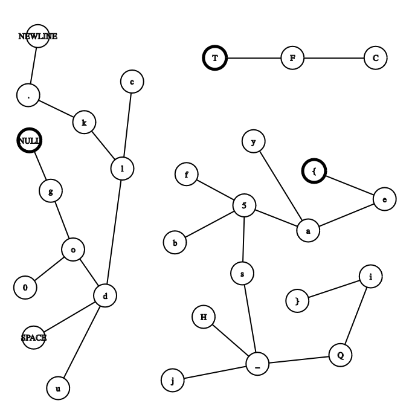

# Writeup for Brave Traveler

## Explanation of the code

The program starts by making a **vector** with type **set** of size 128.

```c++
vector<set<char>> v(128);
```

It calls the function generateMap() with a pointer to the vector v as argument.

```c++
generateMap(v);
```

In the function, we have many modifications to the vector v. The first two are:

```c++
// Code from IDA's cloud-based decompiler
v1 = std::vector<std::set<char,std::less<char>,std::allocator<char>>,std::allocator<std::set<char,std::less<char>,std::allocator<char>>>>::operator[](a1, '.');

v28 = '\n';

std::set<char,std::less<char>,std::allocator<char>>::insert(v1, &v28);

/* ********************************************************************** */

v2 = std::vector<std::set<char,std::less<char>,std::allocator<char>>,std::allocator<std::set<char,std::less<char>,std::allocator<char>>>>::operator[](a1, '_');

v28 = 'H';

std::set<char,std::less<char>,std::allocator<char>>::insert(v2, &v28);
```
  

```c++
// Translation
v['.'].insert('\n');

v['_'].insert('H');
 ```

These lines of code repeat with different values.

  

Let's write down the point of insertion and the value inserted for each modification.

  
```
. NEWLINE
_ H
o d
i }
d l
d u
l c
e a
o 0
l k
NULL g
k .
{ e
a 5
T F
F C
_ j
a y
5 b
g o
d SPACE
_ Q
5 f
5 s
s _
Q i
```
  

Next, the program calls the traverse function with the parameter being a pointer to the vector.


**'g'** is also the letter that the default prompt of the program starts with: **"go0d luck."**

In the traverse function, a queue of type char is created and the number zero is pushed into it.

```c++
// Code from IDA's cloud-based decompiler
std::queue<char,std::deque<char,std::allocator<char>>>::queue<std::deque<char,std::allocator<char>>,void>(q);
LOBYTE(nullByte) = 0;
std::queue<char,std::deque<char,std::allocator<char>>>::push(v7, &nullByte);
```

```c++
// Translation
queue<char> q;
q.push(0);
```

Then, there's a while loop that runs until the queue is empty:

```c++
// Code from IDA's cloud-based decompiler
while ( (unsigned __int8)std::queue<char,std::deque<char,std::allocator<char>>>::empty(v7) != 1 )
```

```c++
// Translation
while(!q.empty())
```

It gets the front of the queue, saves it, prints it and pops it:

```c++
// Code from IDA's cloud-based decompiler
FRONT_VALUE = *(_BYTE *)std::queue<char,std::deque<char,std::allocator<char>>>::front(q);

std::operator<<<std::char_traits<char>>(&std::cout, (unsigned int)FRONT_VALUE);

std::queue<char,std::deque<char,std::allocator<char>>>::pop(q);
```

```c++
// Translation
char front = q.front();
cout << front;
q.pop();
```

Then, it gets the set of characters corresponding to the front character from the vector v:

  
```c++
// Code from IDA's cloud-based decompiler
CURRENT_SET = std::vector<std::set<char,std::less<char>,std::allocator<char>>,std::allocator<std::set<char,std::less<char>,std::allocator<char>>>>::operator[](ourVector, FRONT_VALUE);

START = std::set<char,std::less<char>,std::allocator<char>>::begin(CURRENT_SET);
END = std::set<char,std::less<char>,std::allocator<char>>::end(CURRENT_SET);
```

It then iterates over the set and pushes the characters into the queue:

```c++
// Code from IDA's cloud-based decompiler
while ( (unsigned __int8)std::operator!=(&START, &END) ) // iterate over set
{
    currentValueInSet = *(_BYTE *)std::_Rb_tree_const_iterator<char>::operator*(&START); // obtain value from iterator

    std::queue<char,std::deque<char,std::allocator<char>>>::push(q, &currentValueInSet); // push value into queue
    std::_Rb_tree_const_iterator<char>::operator++(&START); // increment iterator
}
```

```c++
// Translation
for(auto element : v[front]) {
    q.push(element);
}
```

Finally, we have this code for the **traverse** function:
```c++
void traverse(vector<set<char>> &v) {
    queue<char> q;

    q.push(0);

    while(!q.empty()) {
        char front = q.front();

        cout << front;

        q.pop();

        for(auto element : v[front]) {
            q.push(element);
        }
    }
}
```

## The Catch

All of these observations are more than enough to figure out that this function is a simple **BFS** traversal of a graph, our vector.

**BFS** is a fundamental graph traversal algorithm that makes use of a queue data structure to keep track of the nodes to visit.

The graph is represented by the vector of sets. Each character in every set represents a connection between the index of the set and the value.

The program starts with the character 'g' and traverses the graph, printing the characters in the order they are visited.

Let's put our noted values from the graph into a graph visualization tool (e.g. [CS Academy Graph Editor](https://csacademy.com/app/graph_editor/)) to see the graph.

  

<br><br>The problem statement suggests that "There's a whole world left to explore", it's talking about the other components (unconnected parts of the graph). We have 3 components: **"\x00go0d luck.\n"**, **"TFC"**, and another that starts with **'{'**. The last one must be the message.

## The Solution

We could write the message down by traversing the graph manually, we could put this graph in another program and BFS over it starting with node '{', or we could use a debugging tool to modify the first value pushed into the queue to **'{'** (the start node).

I'll use **GDB**.

Commands:
```gdb
b *traverse
r
```

Then ```n``` until we pass the ```mov byte ptr [rbp-0x80], 0 # this sets the value to be pushed into the stack to 0``` instruction.

Then we get the address rbp-0x80 and set it to '{' (0x7b) (123)

```gdb
set *(char*)($rbp - 0x80)='{'
```

```gdb
c
```

Finally, the message gets printed:

```{ea5ybfs_HQji}```


## Flag

```TFCCTF{ea5ybfs_HQji}```


